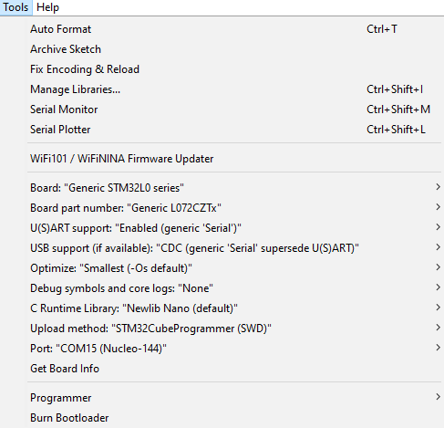
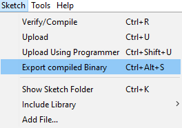
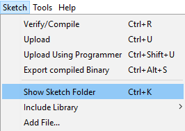
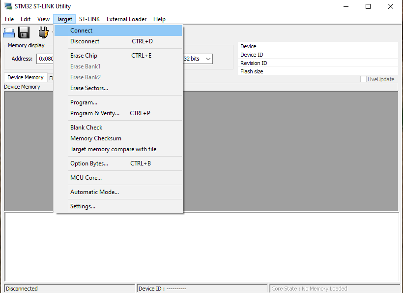
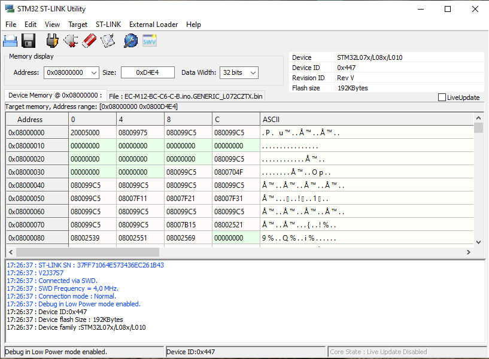
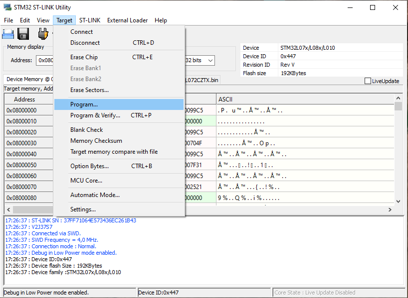
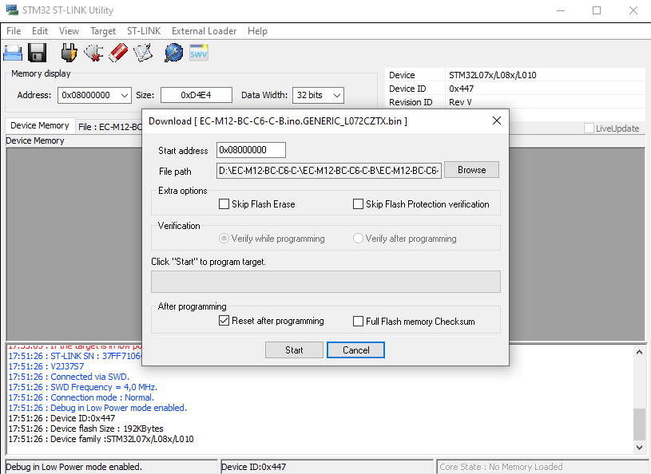
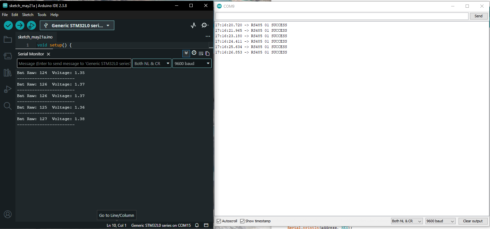
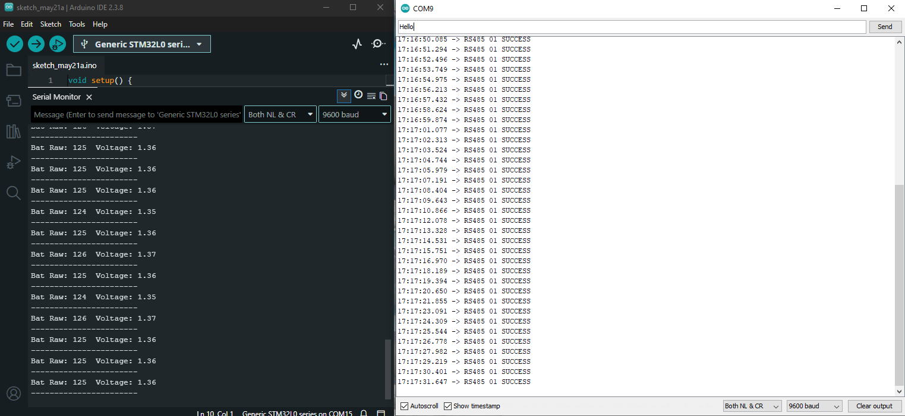
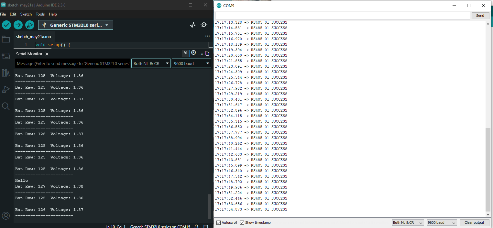

# EC-M12-BC-C6-C-B Test Procedure

## Overview
The **EC-M12-BC-C6-C-B** is a rugged, IP67-rated IoT telemetry device designed for reliable remote monitoring and industrial data collection. Powered by an ultra-low-power **STM32L072CZT6 MCU** and high-capacity lithium batteries, it supports long-term autonomous operation, cellular connectivity, and RS-485 integration for industrial and environmental applications. 

## Product Used

Product: EC-M12-BC-C6-C-B

More information:
https://norvi.io 

## Purpose of This Example 
This example shows how to: 
- Initialize and configure the EC-M12-BC-C6-C-B controller 
- Read sensor data through the RS-485 Modbus interface 
- Connect to the cellular network using the SIM7600 module 
- Publish sensor values to an MQTT/ThingsBoard server 
- Implement low-power operation using shutdown and wake-up control 

## What the User Should Do

Follow the steps below to run the example.
1.  **Hardware Connections**
- Open the lid of the **EC-M12-BC-C6-C-B** device carefully.
- Set the jumper to the **USB programming side**.
- Connect a **Mini USB cable** to the device.
- Carefully connect the **programming header** to the **ST-Link programmer**.
- Move to the **8-pin M8 connector** section.
- Connect the **8-pin M8 cable** to the device.
- Connect the 8-pin M8 cable and interface it with the **RS-485 converter**.
- Connect the pink wire of the M8 cable to RS-485 B, and connect the gray wire to RS-485 A carefully.
      
2.  **Program Upload procedure**

   - Follow this guide to program the STM32 board.
   - Open the EC-M12-BC-C6-C-B Functional test program using Arduino IDE 1.8.19.
   - Go to Tools and configure the settings as shown below.

   

   Generate the binary file for the project:

   **Sketch** **→** **Export Compiled Binary**

   

   After compilation is completed, the generated **.bin** file will be available inside the project folder.

   Open the project folder to view the generated binary files: 
   
   **Sketch** **→** **Show Sketch Folder**

   

   The sketch folder will open, and the generated **.bin** file can be found inside the folder. 

   - Locate the generated **.bin** file inside the sketch folder and copy its file location/path.
   - Open the STM32 ST-LINK Utility application.

     download the STM32 ST-LINK Utility software from the below link and install it.

     https://www.st.com/en/development-tools/stsw-link004.html

  - Connect the **STM32 board** to the **ST-Link programmer**.

    

    

    In the STM32 ST-LINK Utility, connect to the target device.

    Go to:
    
      **Target → Program**
    
      

     Browse and select the generated **.bin** file location.

     Confirm the start address if required, then click **Start** to program the STM32 board.

     Wait until the programming process is completed successfully.

     
    
     Now go back to the **Arduino IDE** and verify that the correct **COM port** is selected.

     Open the Serial Monitor, then open another serial monitor and select the STM board COM port to monitor the communication data, as shown below.

     

     ## What the User Should Expect as a Result

     **When the program runs successfully:**

      - The message will be sent from the right-side serial monitor.
      - The same message can be seen as received on the left-side serial monitor.
      - This confirms successful RS-485 data communication between the devices.

     

     

    ## Device Preparation / Configuration
    - Check that the USB-side jumper is connected correctly.
    - Ensure the ST-LINK programming header is connected properly before programming the device.
    - Check that the 8-pin M8 connector cable is connected properly.
    - Verify that the RS-485 communication wiring is correct and secure.

    ## Required Libraries
    Install the following libraries before compiling

    I2C Devices → Wire.h
    RS485 UART → HardwareSerial
    GSM UART → HardwareSerial
    SD Card via SPI → SPI.h + SD.h
    GPIO / ADC / Serial Monitor → Arduino.h

     ### Installation:
            1. Open Arduino IDE
            2. Go to Library Manager
            3. Search and install the required libraries

    ## Limitations
    
      • This example is provided for demonstration purposes.
      • Additional calibration may be required for precise measurements.
      • Performance may depend on sensor accuracy and environmental conditions.

    ## Safety Notes
    
      • Do not exceed the rated input voltage
      • Ensure proper grounding
      • Incorrect wiring may damage the controller
    
    ## Tested Hardware

    Controller: NORVI EC-M12-BC-C6-C-B
 
      Test Date: [2026-05-21]
    
      Verified By:Kaveesha
      
      Support

      Documentation:

      https://norvi.io
 
      For additional support or inquiries, contact the NORVI support team.

    ## License

      This example is provided for development and educational purposes.

    

    

     
    
    

    

