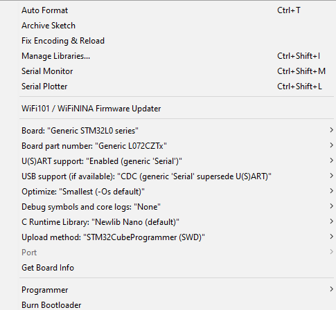
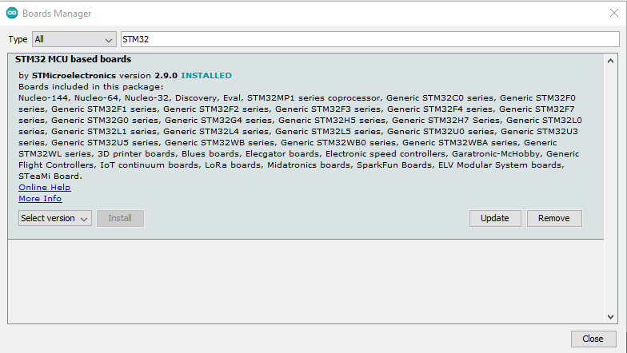

# EC-M12-BC-C6-C-B  
Battery-Powered Cellular IoT Data Logger (IP67 - NB-IoT)

## Overview  
The **EC-M12-BC-C6-C-B** is a rugged, battery-powered IoT data logger with NB-IoT connectivity designed for industrial and remote monitoring applications.
This variant features an **RS485 communication interface** for industrial sensor and system integration.

This repository contains firmware and resources for programming the STM32 microcontroller using the Arduino IDE.

---

## 🧩 Arduino IDE Configuration  

To program the **STM32L0 series** microcontroller in this device using the **Arduino IDE**, follow the configuration below:

### Board Configuration  
- **Board:** Generic STM32L0 Series  
- **Board Part Number:** Generic L072CZTx  
- **U(S)ART Support:** Enabled (Generic Serial)  

### Required Setup Steps  
1. Install the **STM32 Arduino Core** from the Arduino Boards Manager.  
   - Go to: `File → Preferences`  
   - Add the following URL to *Additional Boards Manager URLs*:  
     ```
     https://github.com/stm32duino/BoardManagerFiles/raw/main/package_stmicroelectronics_index.json
     ```
   - Then, go to: `Tools → Board → Boards Manager`, search for **STM32**, and install it.  
2. Select the correct board and part number as listed above.  
3. Connect your board via ST-Link or USB interface.  
4. Select the correct **Port** and **Upload method** under the *Tools* menu.  

---

## 📚 Required Libraries  

The following libraries are required for proper operation. Please ensure they are installed with the correct versions:

| Library Name | Version | GitHub Link |
|---------------|----------|-------------|
| STM32duino Low Power | 1.3.0 | [STM32LowPower](https://github.com/stm32duino/STM32LowPower) |
| STM32RTC | Main Branch | [STM32RTC](https://github.com/stm32duino/STM32RTC?files=1) |
|ModbusMaster | Latest | [MODBUSMASTER](https://github.com/4-20ma/ModbusMaster) |

To install these libraries:  
- Open Arduino IDE → **Sketch → Include Library → Manage Libraries...**  
- Search for the library name and install the mentioned version.  
- Alternatively, you can clone the repositories directly into your `libraries` folder.

---

## 🖼️ Upload and Board Details  

Below are example configurations and board details for uploading code to the STM32:

### Upload Configuration  


### STM32 Board Details  


---

## 🔌 RS485 Communication Interface

The EC-M12-BC-C6-C-B includes an RS485 communication interface designed for reliable industrial communication over long distances.

### Key Features

- Half-duplex RS485 communication
- Supports Modbus RTU protocol (master/slave)

### Typical Use Cases

- Modbus RTU energy meters
- Industrial flow and level sensors
- Remote industrial monitoring applications

---

## 🔗 Useful Links  

- [**Datasheet**](https://norvi.io/docs/norvi-ec-m12-bc-c6-c-b-datasheet/)  
- [**Product Page**](https://norvi.io/products/battery-powered-data-logger/)  
- [**Product Purchase**](https://shop.norvi.lk/products/ec-m12-bc-c6-c-b)

---

## ⚙️ Technical Highlights  
- STM32L072CZTx ARM Cortex-M0+ microcontroller  
- NB-IoT connectivity  
- Battery-powered operation (IP67 enclosure)  
- Ultra-low power consumption  
- Multiple sensor and digital I/O interfaces  

---

## 📧 Support  
For technical support or additional documentation, please visit the [Norvi Support Page](https://norvi.io/contact-us/).
